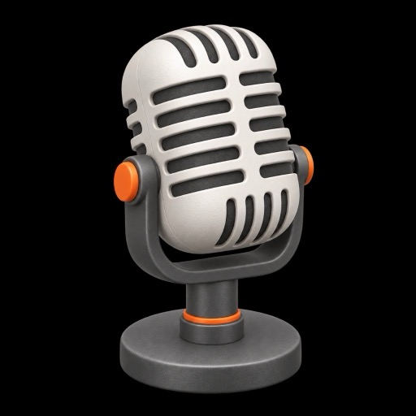

# Echo

<p align="center">
  
</p>

Menu-bar dictation for Mac. Press the shortcut, speak, press again. Echo transcribes and pastes into the app you were using.

Requires macOS 26.3 (Tahoe). Apple Speech is on-device. Whisper, Parakeet, and S1-mini are optional local models.

## Engines

- **Apple Speech** — default
- **Whisper** — WhisperKit (Tiny / Base / Small English, Large v3 Turbo)
- **Parakeet** — FluidAudio TDT (English v2, multilingual v3)
- **Deepgram / Mistral** — optional cloud, API key required

Optional rewrite (Apple Intelligence or S1-mini) is off the paste path. Models download to `~/Library/Application Support/Echo/Models`.

## Run

Open `~/Applications/echo.app`, or from `echo/`:

```sh
xcodebuild -scheme echo -destination 'platform=macOS'
```

Default shortcut is ⌘⇧Space. Change it in Settings.

## Permissions

Microphone. Speech Recognition for Apple. Accessibility to paste (otherwise the transcript stays on the clipboard). Screen Recording is optional — Echo samples a patch of color behind the listening chip so the waveform stays visible, and does not save the image.

Settings can hide the menu bar extra or the Dock icon. The shortcut still works.
