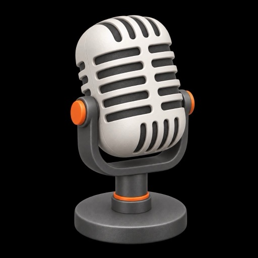

# Echo

<p align="center">
  
</p>

Menu-bar dictation for Mac. Press the shortcut, speak, press again. Echo transcribes and pastes into the app you were using.

Requires macOS 26.3 (Tahoe). Apple Speech is on-device. Whisper, Parakeet, and S1-mini are optional local models.

## Engines

- **Apple Speech** — default
- **Whisper** — WhisperKit (Tiny / Base / Small English, Large v3 Turbo)
- **Parakeet** — FluidAudio TDT (English v2, multilingual v3), Streaming or Standard
- **Deepgram / Mistral** — optional cloud, API key required

Optional rewrite (Apple Intelligence or S1-mini) is off the paste path. Models download to `~/Library/Application Support/Echo/Models`.

## Run

Open `~/Applications/echo.app`, or build and install a fresh Release build:

```sh
./scripts/install-release.sh
```

Always ship Release. The Debug product is a small stub around an unoptimised dylib and it bundles
the test frameworks, which makes every hot path several times slower and pages in badly after the
app has been sitting idle.

To build without installing, from `echo/`:

```sh
xcodebuild -scheme echo -configuration Release -destination 'platform=macOS'
```

Default shortcut is ⌘⇧Space. Change it in Settings.

## Permissions

Microphone. Speech Recognition for Apple. Accessibility to paste (otherwise the transcript stays on the clipboard). Echo does not capture or record the screen.

Settings can hide the menu bar extra or the Dock icon. The shortcut still works.

## Latency

Echo logs what each take cost. To see it:

```sh
log show --predicate 'subsystem == "echo"' --last 1h --style compact
```

`hotkey→chip` is the overlay appearing, `stop→transcript` is recognition, and `stop→paste` is what
you actually wait for. Stats in Settings shows the same two figures averaged.

Apple Speech transcribes while you talk, so stop → paste does not grow with how long you spoke. If
a take ever comes back wrong, `defaults write com.fuadnafiz98.echo echo.appleBatchFallback -bool YES`
restores the old transcribe-after-stop behaviour.

Parakeet has two pipelines, chosen in Settings → General when Parakeet is the engine:

- **Streaming** (default) transcribes in windows cut at your pauses while you talk, and decodes the
  tail each time you pause. Stopping after a pause pastes with no model work left, whatever the
  length of the take. Stopping mid-word decodes only the last few seconds.
- **Standard** transcribes the whole recording after you stop. The wait grows with the take.

Every streaming take logs `streaming tail=… speculativeHit=… reused=…`; `speculativeHit=true` means
stop ran no model. `stop breakdown` splits each stop into capture flush, waiting for the engine and
decode, and names the engine that was used. If Parakeet is still loading when a take starts, Apple
Speech listens alongside it and covers the take (`served=apple-fallback`).

To measure Parakeet on this Mac (stop cost, word error rate against a known script, memory), run
the benchmark suite in Release:

```sh
TEST_RUNNER_ECHO_PARAKEET_BENCH=1 TEST_RUNNER_ECHO_BENCH_OUT=/tmp/echo-bench \
xcodebuild test -scheme echo -configuration Release ENABLE_TESTABILITY=YES \
  -destination 'platform=macOS,arch=arm64' -skipPackagePluginValidation -skipMacroValidation \
  -only-testing:echoTests/ParakeetBenchmarkTests
```
